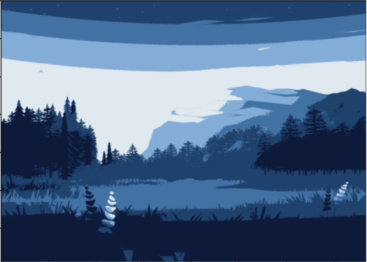
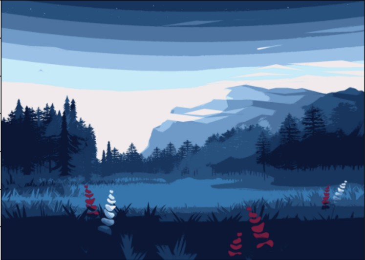
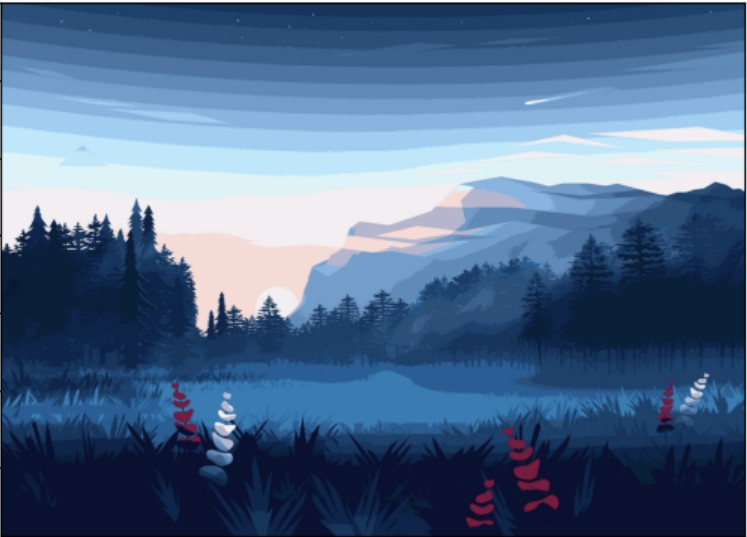

# Image_Color_Analyze
Using sklearn, the clusters will choose the pixel that have the most color, then change the similar nearby to that color.

## Orginal

## 5 Clusters

## 10 Clusters

## 20 Clusters

